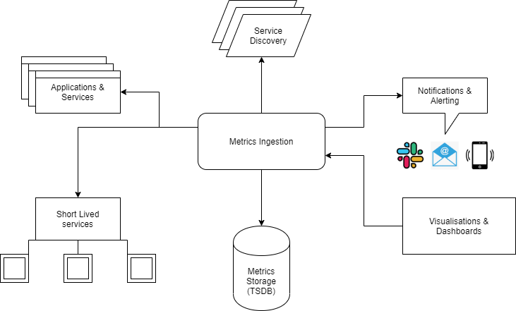

# dataworks-metrics-infrastructure
Repo for storing the Metrics Infrastructure to be used in AWS

## Basic infrastructure outline

## What's required?

**Time Series Database (TSDB)** - There should be the capability for a theoretically unlimited history of metrics and a shared store for potentially multiple servers that will be collecting those metrics. Having this shared store will allow for the horizontal scaling of the application that is collecting the metrics, and a single source of truth for any queries that need to be carried out on the metrics. Transformation techniques such as downsampling should be able to be carried out across the metrics to aid with the speed of queries.  

**Endpoints/Exporters** - Endpoints need to serve the appropriate metrics in a universal format that can be consumed by a single application. These endpoints should be able to serve metrics from a wide array of platforms and expose relevant metrics for them. This should be done either via agents or through an exporter that can translate the metrics. Ephemeral jobs where an exporter or agent makes less sense, need to be able to push their metrics to the application before exiting.  

**Dashboards** - Needs to be capable of offering a view across any of the metrics captured. Importantly it needs to be capable of fulfilling some of the limitations experienced on the CloudWatch platform. It should be easily accessible to anyone who needs it and be easy to update with new visualisations. There should also be support for (LDAP/GitHub??) authentication integration.  

**Alerting** - Alerts to be triggered on certain defined metrics and can be routed to the correct integration. The configurations should be able to be stored as code and there needs to be support for multiple integrations (email, ticketing services, etc.)  

**Service Discovery** - The server should be able to detect the instances of scaled applications and register/deregister them as data sources.

## Why not CloudWatch?

Up until now, we have utilised CloudWatch Metrics as the only source of metric information with the Estate. However, CloudWatch suffers from certain limitations, which has led to us considering other solutions. The main issues that result from using CloudWatch are:  

* A delay in the availability of metrics. CloudWatch is a low-priority service in terms of resource allocation at the provider level, and whilst some CW information does appear in a timely fashion, and metrics are reasonably good at this, there still remains an inherent unreliability in the amount of time that must pass before CW information can be expected to appear. Furthermore, this period is not within the control of us as the consumer of CW. Whilst all CW information would be eventually consistent, as the CW information is still guaranteed to arrive, this could also lead to windows of time where cross-application metric-analysis is not reliable, as CW metrics from one service may have arrived whilst the information from another service has not, which could affect our ability to alert on and investigate issues.  

* The usefulness of CloudWatch Dashboards. Whilst sufficient for basic views on CW metrics, they are not the greatest at presenting information, and the inability for CW to support tags/custom dimensions on metrics (see below) means that dashboards would end up being very specific to a targeted process rather than allowing for the drawing in of various data sources. Experience shows that a dashboard that isn't providing valuable information correctly will be ignored. Additionally, CW Dashboards do not allow for datasources outside of CW, unlike some alternatives.  

* The availability and Access Control of CloudWatch Dashboards. Whilst CW is capable of presenting metric information in dashboards, they are prohibitively awkward to work with (previous attempts have seen us create the dashboards in the AWS Console and export the resultant XML into Terraform, using this to deploy the dashboard). Additionally, they are limited in scope in terms of their ability to present information from multiple metric sources in a legible fashion. But more important than this, is that a CW Dashboard would rely on the consumer of said Dashboard to have an IAM Account, and be onboarded to our AWS infrastructure. This is not ideal.  

* The lack of custom dimensions for metrics. As previous work with CW Metrics has highlighted, our use case is entirely limited by the inability for it to provide a facility for custom dimensions for their metrics. This means that, to take HTME as an example, horizontally scaling the HTME application has resulted in the work previously done to obtain metrics from this application being of limited use, as we are not able to tag HTME-generated metrics with a custom dimension indicating their source Instance (despite this being a built-in expectation of CW and despite being able to filter the metrics by Instance). As a result, the HTME dashboard is just a "rough indication" of collections being processed and is unable to provide a clear view into the processing that is being done on a per-collection or overall basis.  

* CloudWatch still potentially has a place for AWS-first services that we utilise, such as Lambda. However, these metrics could potentially be collected from CW and posted to another metrics service, in order to centralise the service.