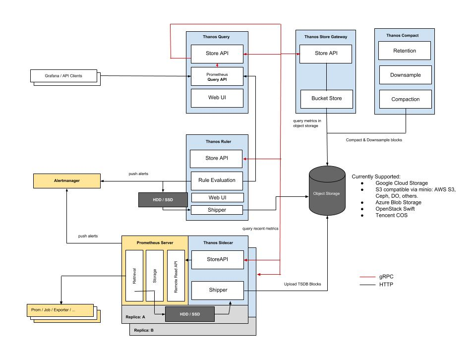

# DEPRECATED - MIGRATING TO GITLAB.COM (WIP) dataworks-metrics-infrastructure
Repo for storing the Metrics Infrastructure to be used in AWS

## Local Development

### Requirements
* Terraform 0.12
* Python 3
* JQ
* Access to DataWorks AWS environments

### Bootstrapping
Before beginning development you will need to generate some Terraform files from templates and clone the dashboards repo. To do this, simply run the following:
```bash
make bootstrap
```
You will then be able to develop against the development account (default Terraform workspace). If you want to run a plan against another environment then you will need to change Terraform workspace by **SETTING THE `TF_WORKSPACE` ENVIRONMENT VARIABLE** instead of using `terraform workspace select`. This is due to that environment variable being used within `bootstrap_terraform.py` for variable lookups

## Basic infrastructure outline


## What's required?

**Time Series Database (TSDB)** - There should be the capability for a theoretically unlimited history of metrics and a shared store for potentially multiple servers that will be collecting those metrics. Having this shared store will allow for the horizontal scaling of the application that is collecting the metrics, and a single source of truth for any queries that need to be carried out on the metrics. Transformation techniques such as downsampling should be able to be carried out across the metrics to aid with the speed of queries.

**Endpoints/Exporters** - Endpoints need to serve the appropriate metrics in a universal format that can be consumed by a common application. These endpoints should be able to serve metrics from a wide array of platforms and expose relevant metrics for them. This should be done either via agents or through an exporter that can translate the metrics. Ephemeral jobs (where an exporter or agent makes less sense) need to be able to push their metrics to the collecting application before exiting.

**Dashboards** - These need to be capable of offering a view across any of the metrics captured. Importantly it needs to be capable of fulfilling some of the limitations experienced on the CloudWatch platform (see below). They should be easily accessible to anyone who needs then and be easy to update with new visualisations. There should also be support for (LDAP/GitHub??) authentication integration. These should be able to be stored as code.

**Alerting** - Alerts to be triggered on certain defined metrics and can be routed to the correct integration. The configurations should be able to be stored as code and there needs to be support for multiple integrations (email, ticketing services, etc.)

**Service Discovery** - The server should be able to detect the instances of scaled applications and register/deregister them as data sources. If necessary, ephemeral jobs will need to be able to register themselves during their transient lifecycles.

## Why not CloudWatch?

Up until now, we have utilised CloudWatch Metrics as the only source of metric information with the Estate. However, CloudWatch suffers from certain limitations, which has led to us considering other solutions. The main issues that result from using CloudWatch are:

* A delay in the availability of metrics; CloudWatch is a low-priority service in terms of resource allocation at the provider level, and whilst some CW information does appear in a timely fashion, and metrics are reasonably good at this, there still remains an inherent unreliability in the amount of time that must pass before CW information can be expected to appear. Furthermore, this period is not within the control of us as the consumer of CW. Whilst all CW information would be eventually consistent, as the CW information is still guaranteed to arrive, this could also lead to windows of time where cross-application metric-analysis is not reliable, as CW metrics from one service may have arrived whilst the information from another service has not, which could affect our ability to alert on and investigate issues.

* The usefulness of CloudWatch Dashboards; Whilst sufficient for basic views on CW metrics, they are not the greatest at presenting information, and the inability for CW to support tags/custom dimensions on metrics (see below) means that dashboards would end up being very specific to a targeted process rather than allowing for the drawing in of various data sources. Experience shows that a dashboard that isn't providing valuable information correctly will be ignored. Additionally, CW Dashboards do not allow for datasources outside of CW, unlike some alternatives.

* The availability and Access Control of CloudWatch Dashboards; Whilst CW is capable of presenting metric information in dashboards, they are prohibitively awkward to work with (previous attempts have seen us create the dashboards in the AWS Console and export the resultant XML into Terraform, using this to deploy the dashboard). Additionally, they are limited in scope in terms of their ability to present information from multiple metric sources in a legible fashion. But more important than this, is that a CW Dashboard would rely on the consumer of said Dashboard to have an IAM Account, and be onboarded to our AWS infrastructure. This is not ideal. 

* The lack of custom dimensions for metrics; As previous work with CW Metrics has highlighted, our use case is entirely limited by the inability for it to provide a facility for custom dimensions for their metrics. This means that, to take HTME as an example, horizontally scaling the HTME application has resulted in the work previously done to obtain metrics from this application being of limited use, as we are not able to tag HTME-generated metrics with a custom dimension indicating their source Instance (despite this being a built-in expectation of CW and despite being able to filter the metrics by Instance). As a result, the HTME dashboard is just a "rough indication" of collections being processed and is unable to provide a clear view into the processing that is being done on a per-collection or overall basis.

* CloudWatch still potentially has a place for AWS-first services that we utilise, such as Lambda. However, these metrics could potentially be collected from CW and posted to another metrics service, in order to centralise the service.

## Solution

The toolset we shall use is Prometheus. It answers all of our questions in regards to metrics ingestion. It will be deployed using ECS, as this suits our needs for size and scalability.
As shown in the images, the tool should be split over Development (DEV,QA,INT,MGMT-DEV) and Production (MGMT, PREPROD, PROD). This allows us to split out the production data, following similar patterns seen elsewhere on the project.  As far as external parties access is required, SRE need access to scrape metrics from `:9090/metrics` on our Production instance.  


Metrics aggregation shall be done by basing Prometheus in its own VPC per environment, and having VPC peering connections in to the other VPCs in that Environment. In the normal Prometheus workflow, there is no requirement for the targets to talk back.


### Thanos

To answer one of our most important requirements, in long-term metics storage we are going to integrate [Thanos](https://github.com/thanos-io/thanos).  

Thanos is a set of components that can be composed into a highly available metric system with unlimited storage capacity, which can be added seamlessly on top of existing Prometheus deployments.

Thanos leverages the Prometheus 2.0 storage format to cost-efficiently store historical metric data in any object storage while retaining fast query latencies. Additionally, it provides a global query view across all Prometheus installations and can merge data from Prometheus HA pairs on the fly.



Concretely the aims of the project are:

1. Global query view of metrics.
1. Unlimited retention of metrics.
1. High availability of components, including Prometheus.

Features
* Global querying view across all connected Prometheus servers
* Deduplication and merging of metrics collected from Prometheus HA pairs
* Seamless integration with existing Prometheus setups
* Any object storage as its only, optional dependency
* Downsampling historical data for massive query speedup
* Cross-cluster federation
* Fault-tolerant query routing
* Simple gRPC "Store API" for unified data access across all metric data
* Easy integration points for custom metric providers

We are currently working on updating the current infrastructure Thanos, and will reflect the architecture documents in due time.

### Alerts

Alerts will be handled using Prometheus' Alertmanager which will be located in the primary VPC. With this pattern alerts can either be pushed from a Prometheus in the target VPC or from the Thanos Ruler which would be located in the primary VPC. This pattern is shown in the Thanos architecture [here](#Thanos). Although there is the capability for two methods of pushing alerts we are going to take the latter option for the following reasons:

* The logical flow of routing does not need to be changed. So all queries will still run through the thanos query node, then down into the target VPC. As opposed to alerts being pushed up from the target environment into the primary VPC.
* The Thanos ruler can be used to optimise queries to help improve the speed of alert resolution, if slow complex queries are required.
* Configuration for alerts can be centralised, simplifying the updating and deployment of those rules.

The drawback is that as we are routing the queries through the query node, there is an increased chance of failed queries. However there are mitigation steps that can be taken to handle this situation should it occur outlined [here](https://thanos.io/components/rule.md/#must-have-essential-ruler-alerts)

## Current Architecture


## Uncommon Dependancies
When creating new services to consume `internal-compute`, all work should be carried out and applied in this repo, before adding the remote state to the `interface_vpce_source_security_group_ids` list in the `internal-compute` [VPC](https://git.ucd.gpn.gov.uk/dip/aws-internal-compute/blob/c73d0a6a159debe59795d5be6b99c3f947414eeb/vpc.tf#L19), otherwise co flicts occurr which break applies.


## VPC Interfaces and Security Groups 

To use a VPC interface endpoint you must first create one as seen below for the internet proxy endpoint:   

    resource "aws_vpc_endpoint" "secondary_internet_proxy" {
        vpc_id              = module.vpc.outputs.vpcs[local.secondary_role_index].id
        service_name        = data.terraform_remote_state.internet_egress.outputs.internet_proxy_service.service_name
        vpc_endpoint_type   = "Interface"
        security_group_ids  = [aws_security_group.secondary_internet_proxy_endpoint.id]
        subnet_ids          = module.vpc.outputs.private_subnets[local.secondary_role_index]
        private_dns_enabled = false
        tags                = merge(local.tags, { Name = var.name })
     }
     
To be able to use this endpoint from your service a Security Group must be associated with it. In the case of this example, we want to be able to communicate with the above interface from the `cert_metrics` SG. After adding the required `ingress/egress` rules you will also have to associate the SG with the correct VPC.  
   
       interface_vpce_source_security_group_ids = local.is_management_env ? [
       aws_security_group.grafana[0].id,
       aws_security_group.thanos_query[0].id,
       aws_security_group.thanos_ruler[0].id,
       aws_security_group.alertmanager[0].id,
       aws_security_group.outofband[0].id,
       aws_security_group.prometheus.id,
       aws_security_group.cloudwatch_exporter.id,
       aws_security_group.thanos_store[0].id,
       aws_security_group.metrics_cluster.id,
       aws_security_group.mgmt_metrics_cluster[0].id,
       aws_security_group.cert_metrics.id] 
       ] : [
       aws_security_group.prometheus.id,
       aws_security_group.cloudwatch_exporter.id,
       aws_security_group.pdm_exporter[0].id,
       aws_security_group.hbase_exporter[0].id,
       aws_security_group.metrics_cluster.id,
       aws_security_group.cert_metrics.id] 

The `cert_metrics` SG is deployed into the `montoring-slave vpc` in all envs and therefore it sits on both sides of the above if/else condition of `local.is_management_env`.   
This also needs to reflected in the VPC module `vpc.tf.j2`.  

    interface_vpce_source_security_group_ids   = [
     var.interface_vpce_source_security_group_ids[0],
     var.interface_vpce_source_security_group_ids[1],
     var.interface_vpce_source_security_group_ids[2],
     var.interface_vpce_source_security_group_ids[3],
     var.interface_vpce_source_security_group_ids[4],
     var.interface_vpce_source_security_group_ids[7],
     var.interface_vpce_source_security_group_ids[8],
     var.interface_vpce_source_security_group_ids[9]
    
    
     var.interface_vpce_source_security_group_ids[0],
     var.interface_vpce_source_security_group_ids[1],
     var.interface_vpce_source_security_group_ids[2],
     var.interface_vpce_source_security_group_ids[3],
     var.interface_vpce_source_security_group_ids[4],
     var.interface_vpce_source_security_group_ids[5]
    
     var.interface_vpce_source_security_group_ids[5],
     var.interface_vpce_source_security_group_ids[6],
     var.interface_vpce_source_security_group_ids[7],
     var.interface_vpce_source_security_group_ids[8],
     var.interface_vpce_source_security_group_ids[9],
     var.interface_vpce_source_security_group_ids[10]
    
    ]
Because `cert_metrics` is the fifth SG in our `common-vpc.tf` and is in the `monitoring-slave-vpc`, it is referred to by its index and put into the `if roles[0] == "slave"` condition.  
This line specifically refers to the `cert_metrics` SG `var.interface_vpce_source_security_group_ids[5]`
